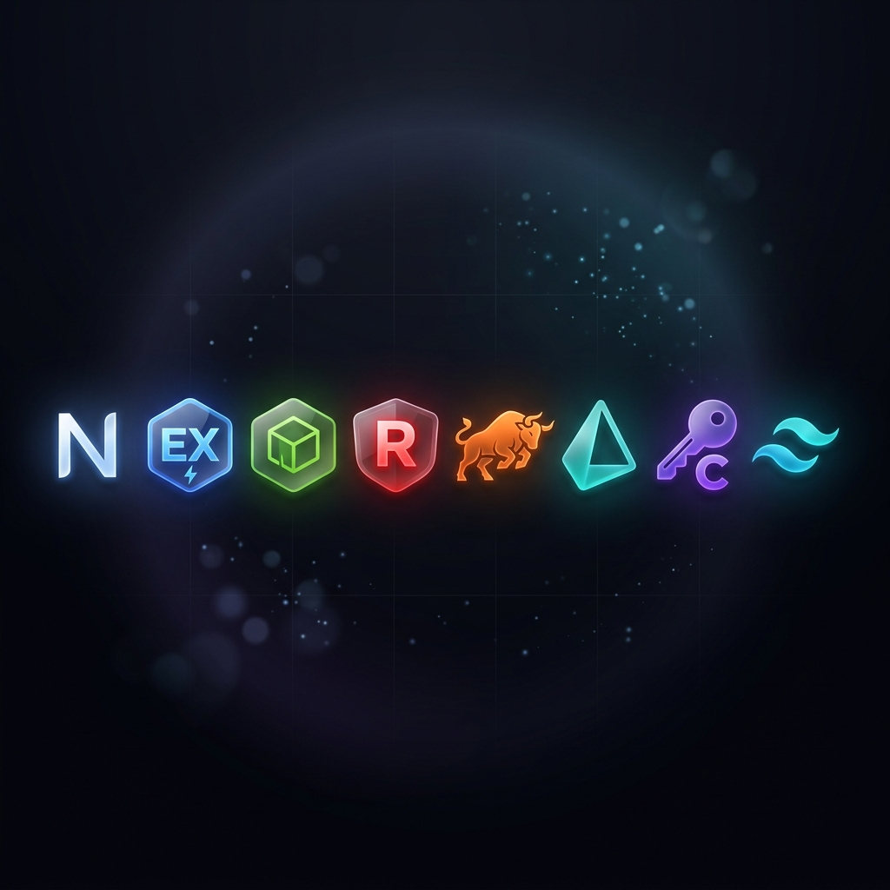
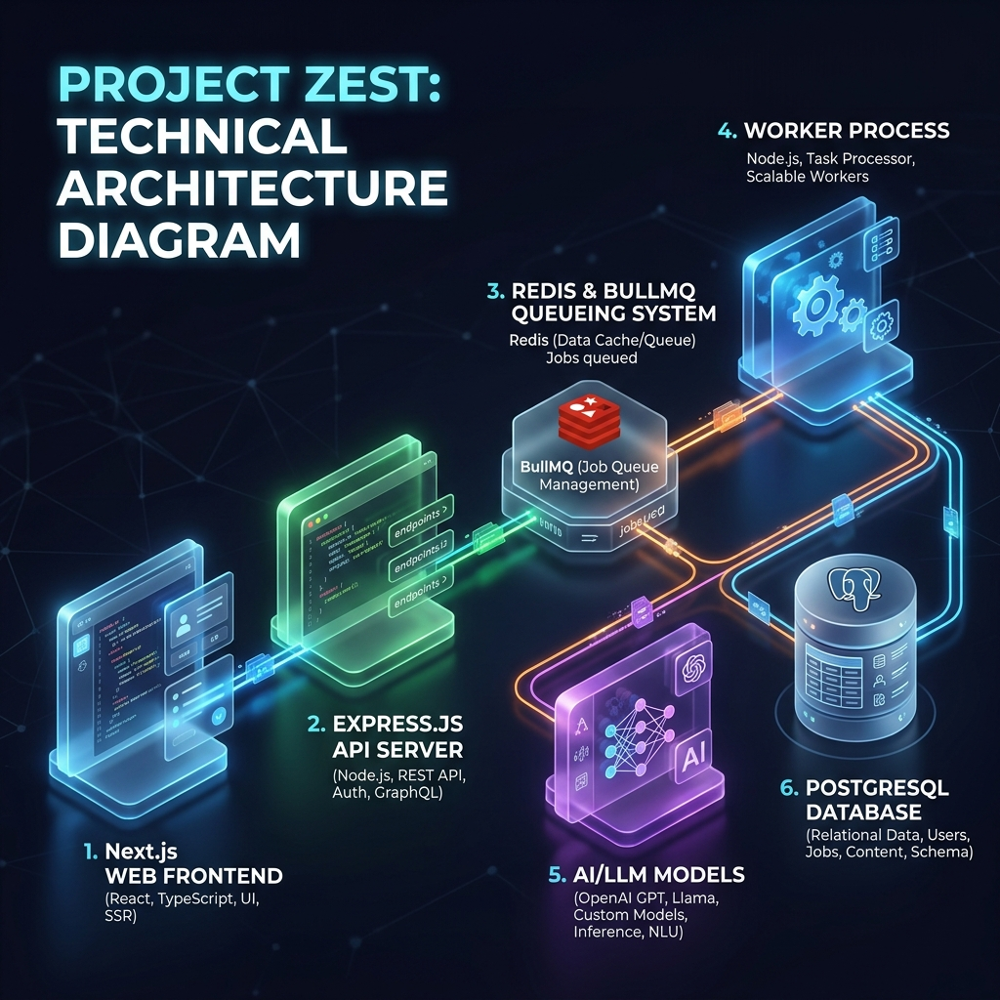

<div align="center">
  

  # 🍋 Zest: The Ultimate AI Productivity Engine

  **Zest** is a high-performance, AI-powered application designed for lightning-fast task processing. Built with a robust decentralized architecture, Zest handles intensive AI operations asynchronously to ensure a seamless, non-blocking user experience. 

  

  ---

</div>

## 📖 Overview

In modern web development, running heavy AI tasks (like generating notes, questions, or summaries via LLMs) synchronously can cripple user experience. **Zest solves this** by utilizing a robust **Producer-Consumer architecture**.

This repository is split into two distinct, scalable components:
- [**The Web Client (Next.js)**](./web/README.md) - The sleek, user-facing frontend.
- [**The Server Engine (Express.js + BullMQ)**](./server/README.md) - The powerhouse behind the asynchronous task queuing and AI logic.

---

## 🏗️ Architecture & Core Workflow

<div align="center">
  
</div>

Zest uses an orchestrated, event-driven pattern to ensure zero front-end blocking:

1. **User Action (Frontend)**: The user requests an AI summary or generation through the Next.js `web` client. 
2. **API Delegation (Producer)**: The request hits the Node.js `server`. Instead of waiting for an AI API (like Gemini or OpenAI) to respond, the server creates a **job payload**, pushes it to a **BullMQ** queue, and returns an immediate "Processing" response to the client.
3. **Queue Mechanism (Redis)**: **Redis** acts as the high-speed, volatile message broker. It tracks job states (`waiting`, `active`, `completed`, `failed`), retry logic, and concurrency controls via BullMQ.
4. **Task Processing (Consumer Workers)**: Dedicated Worker processes independently pick up jobs from Redis. 
5. **AI Execution & Smart Caching**: The Worker retrieves cached results directly from Redis if similar tasks were queried earlier. Otherwise, it calls the LLM APIs (utilizing multiple fallback providers to guarantee uptime).
6. **Data Persistence (PostgreSQL + Prisma)**: Once the AI finishes generating, the worker stores the final structured data securely via **Prisma** into the **Neon PostgreSQL database**, updating the job status.
7. **Client Updates**: The frontend polls or receives real-time updates regarding the job completion, rendering the final output to the user smoothly.

---

## 📂 Project Structure

Zest follows a strict monorepo-style separation of concerns:

### 🖥️ 1. [The Server (`/server`)](./server/README.md)
The backend REST API and the BullMQ Queue processors. Features robust database connection pooling, Clerk auth middleware validation, Redis caching, and dynamic LLM router configurations.

### 🌐 2. [The Web Client (`/web`)](./web/README.md)
The Next.js 14 App Router application. Features the glassmorphic, responsive Tailwind UI, state management, authenticated dashboards, and dynamic job status polling mechanisms.

---

## 🚀 Getting Started

### Prerequisites
- Node.js (v20+)
- Postgres Database (e.g., Neon.tech)
- Redis instance (e.g., Upstash or local Docker)
- LLM API Keys (Gemini, OpenAI, Groq, etc.)
- Clerk API Keys for Authentication

### Setup

1. **Clone & Install Dependencies**
```bash
git clone https://github.com/your-username/zest.git
cd zest

# Install server dependencies
cd server && npm install
# Install web dependencies
cd ../web && npm install
```

2. **Configure Environments**
Copy the respective `.env.example` files in both `/server` and `/web` to `.env` and fill in your keys.

3. **Run Development Mode (Concurrently)**
Open two terminals.
```bash
# Terminal 1: Run the API and Worker engine
cd server
npm run dev

# Terminal 2: Run the frontend Next.js app
cd web
npm run dev
```

---

*Zest – Adding zest to your productivity with smart AI queues.*