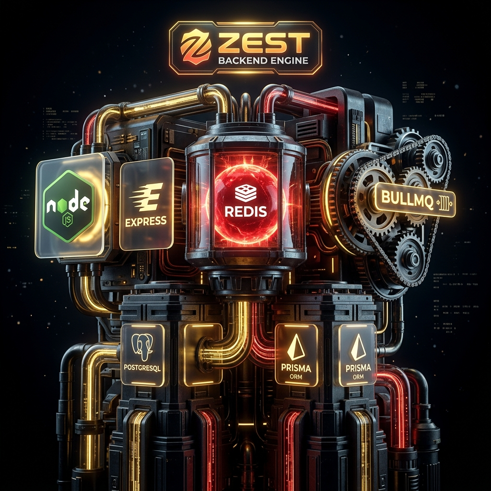

<div align="center">
  

  # ⚙️ Zest Server Engine

  The powerhouse behind Zest's asynchronous task processing and intelligence operations.

</div>

---

## 🏗️ Architecture & Core Components

This directory encapsulates the robust backend REST API and background Worker processes orchestrated by **BullMQ** and **Redis**. It sits at the heart of Zest, ensuring that heavy AI operations never block the event loop or the user's interface.

### The Stack

- **Express.js (TypeScript)**: A battle-tested foundation providing routing, middleware (Clerk authentication integration), limits, and validation.
- **BullMQ**: An incredibly fast, robust Redis-based queue system handling asynchronous producer/consumer patterns, concurrency settings, delayed operations, and retry logic.
- **Redis (ioredis)**: The fast in-memory data store handling state preservation for BullMQ, caching AI responses for rate-limit optimizations, and overall task tracking.
- **PostgreSQL via Prisma ORM**: The primary database for final task persistence, user analytics, and application models.
- **Multi-Provider AI Fallbacks**: Direct SDK integrations with Groq, Gemini, Claude, and OpenAI to provide 99.9% uptime for AI generations.

---

## 🗄️ Deep-Dive into the Directory Structure

```bash
server/
├── prisma/               # Prisma Schema, Migrations, and database seeds
├── dist/                 # Compiled JavaScript outputs
├── src/                  
│   ├── app.ts            # The core Express logic, middleware bindings, CORS setup
│   ├── server.ts         # Boots the HTTP server and validates ENV variables
│   │
│   ├── queues/           # BullMQ Orchestration Layer
│   │   ├── connection.ts # Shared Redis connection for queues and workers
│   │   ├── ai.queue.ts   # The "Producer" pushing AI Requests into Redis
│   │   └── workers/      # The "Consumers" 
│   │       └── ai.worker.ts # Actively processes jobs in the background
│   │
│   ├── modules/          # Domain-Driven Design (Controllers, Routes)
│   │   ├── ai/           # Dedicated handlers for Summaries, Q&A, and Generation
│   │   ├── jobs/         # Routes fetching job status and long-polling utilities
│   │   └── user/         # Webhook listeners for Clerk Auth events
│   │
│   ├── providers/        # LLM Clients
│   ├── config/           # Centralized dot-env variables and constant variables
│   └── middleware/       # Clerk Auth protection and generic handlers
└── types/                # Global TypeScript declarations
```

---

## 🛠️ The Job Queue Workflow (`BullMQ`)

By default, an AI operation (like generating a massive study note) takes ~3-10 seconds. In a synchronous HTTP request, holding the connection open that long is risky (timeouts, blocking, poor UX).

Zest solves this entirely:
1.  **Request Initiation**: A route receives a `POST` request to generate a summary.
2.  **Job Enqueue**: The controller immediately calls `<queue>.add('job-name', { data })`. It returns a generated `jobId` HTTP `202 Accepted` response.
3.  **Worker Interception**: The `ai.worker.ts` instance detects a new job.
4.  **Processing & Fallbacks**: The worker validates the data, queries the LLM provider, and retries with a fallback provider if it fails.
5.  **Completion**: On complete, the worker writes the final output to **Postgres** and marks the job in **Redis** as `Completed`, leaving the payload behind.
6.  **Polling (Status)**: The `/jobs/:id` route is polled by the client to grab the final data once the state changes from `active` -> `completed`.

---

## 🚀 Development Setup (Local)

1. Ensure instances of **Redis** and **PostgreSQL** are running. You can use Upstash, Neon, or Docker.
2. Provide your `.env` variables (e.g., `REDIS_URL`, `DATABASE_URL`, `CLERK_SECRET_KEY`).
3. Start the server concurrently via TypeScript watch mode:
```bash
npm run dev
```
