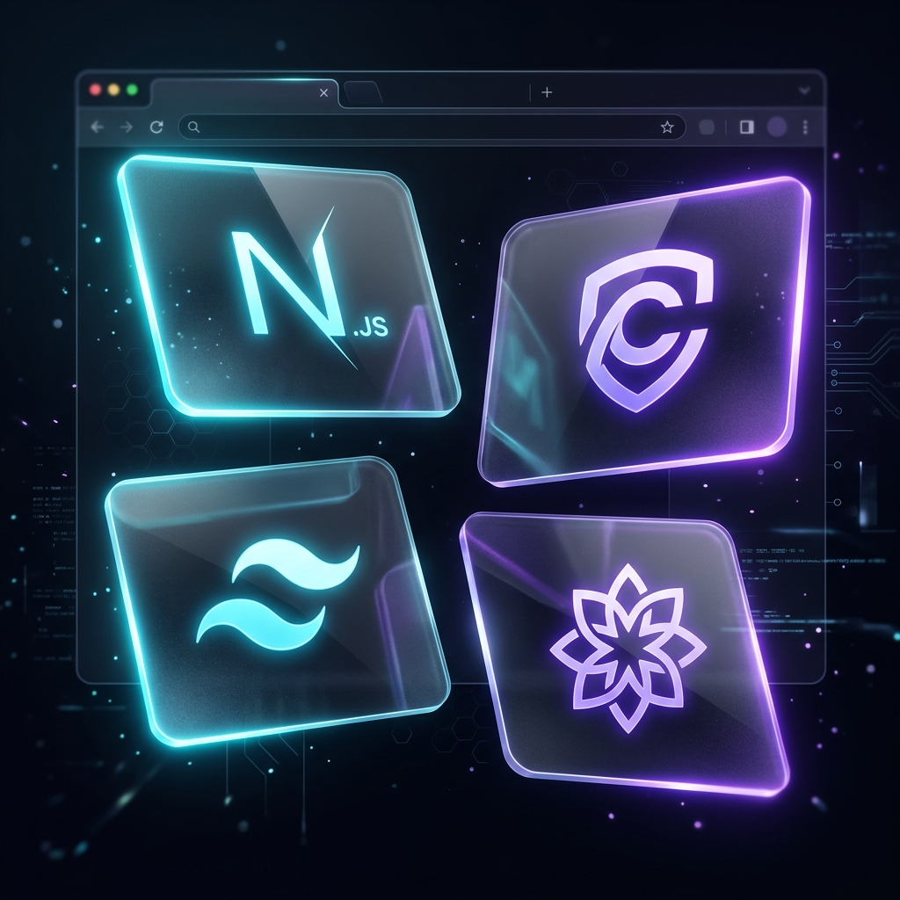

<div align="center">
  

  # 🌐 Zest Web Client

  The sleek, responsive, glassmorphic Next.js App Router for the Zest AI Intelligence Engine.

</div>

---

## 🎨 Overview & Tech Stack

The `/web` directory contains the highly interactive, performance-driven frontend built to interface seamlessly with Zest's backend worker queues. Designed iteratively for a "premium" feel, it leverages modern styling capabilities and complex polling logic to handle asynchronous data beautifully.

### The Stack

- **Next.js 14+ (App Router)**: Server Components by default. Heavy utilization of Layouts, Pages, and dynamic routing for dashboards.
- **Clerk Authentication**: Edge-ready, secure authentication with custom Next.js middleware and seamless user synchronization.
- **Tailwind CSS classes**: Functional, flexible styling built around a dark, vibrant, glassmorphism design ethos.
- **TypeScript**: Ensuring end-to-end type safety between the UI components, network states, and returned API payloads.
- **Lucide React**: Crisp, modern typography and SVG iconography for the dynamic AI loading states.

---

## 🏗️ Deep-Dive into the Directory Structure

```bash
web/
├── app/                  # Next.js App Router Setup
│   ├── (auth)/           # Route Groups for dynamic Clerk pages (Sign-In, Sign-Up)
│   ├── dashboard/        # The authenticated AI workspace
│   │   ├── layout.tsx    # Sidebar UI, Dashboard context providers
│   │   └── page.tsx      # Landing view for tasks
│   ├── layout.tsx        # Global Root Layout (Themes, Fonts, Providers)
│   └── page.tsx          # Public Landing Page (Marketing, Sign up CTAs)
│
├── components/           # Reusable View Layer
│   ├── Navbar.tsx        # Top navigation & user profile
│   ├── Sidebar.tsx       # Core navigation routes
│   ├── Markdown.tsx      # Robust markdown rendering for AI responses
│   ├── Skeleton.tsx      # Advanced, glowing loading placeholders for async UX
│   └── Provider.tsx      # Top-level context wrappers (Auth Provider)
│
├── hooks/                # Complex Client Logic
│   └── usePolling.ts     # The hook fetching /api/jobs/:id asynchronously
│
├── lib/                  # Utilities
│   └── classNames.ts     # Tailwind merge / cn utility classes
│
├── public/               # Static Logos & SVGs
└── types/                # Types representing the Job statuses and AI payload definitions
```

---

## 🔄 Dynamic Polling Workflow (Client Side)

Since Zest delegates heavy lifting (Summaries, Note Generation, Question Answering) to a separated background worker process, the frontend is built entirely around an **Eventual Consistency** model rather than blocking the UI.

### 1. Job Genesis
When the user clicks "Generate", the Next.js Client Component makes a `POST` request to the backend `server`. 
Instead of waiting 10-15 seconds for the entire AI operation to finish, the server immediately returns a `jobId`.

### 2. Loading State & Polling
The UI enters a "Processing" state (rendering premium generic **Skeletons**). A background React Hook (`usePolling` or similar effect iteration) is initiated. Every 2 seconds it calls `GET /jobs/{jobId}`.

### 3. Displaying Final State
If the worker returns `status: "completed"`, polling terminates, and the payload is deeply parsed by the `Markdown.tsx` component into syntax-highlighted HTML or Rich Text, creating a magical snappy user experience.

---

## 🚀 Local Development

Ensure the backend Express server and BullMQ workers are running before testing standard AI features to avoid infinite polling.

1. **Install Dependencies**
```bash
npm install
```

2. **Supply Keys**
Create `.env.local` containing your Clerk Publishable Key (`NEXT_PUBLIC_CLERK_PUBLISHABLE_KEY`) and the URL to your local Zest backend API (`NEXT_PUBLIC_API_URL`, usually `http://localhost:8000`).

3. **Start the Web Client**
```bash
npm run dev
```

The Next.js Application will launch on **http://localhost:3000** automatically syncing authenticated requests to your local API setup.
